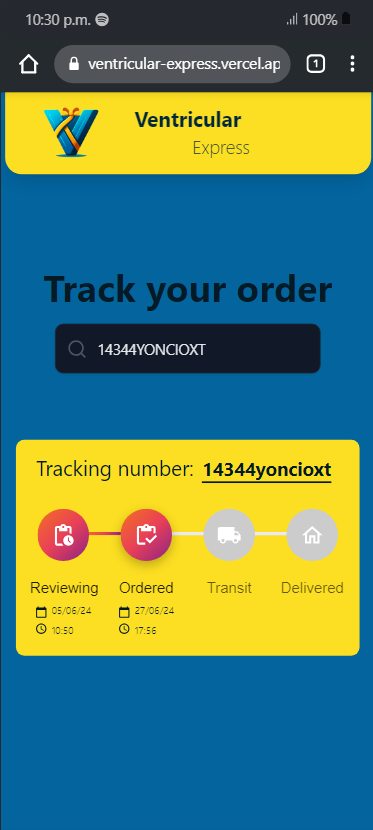

# Ventricular Express

Ventricular Express es una aplicación frontend para rastrear pedidos y mostrar el estado y progreso del paquete a su destino.

## Captura de Pantalla



- **14344YONCIOXT**


## Características

- **Revisión de Pedidos:** Verifica el estado inicial de tu pedido.
- **Ordenado:** Muestra cuándo se realizó el pedido.
- **En Tránsito:** Indica que el pedido está en camino a su destino.
- **Entregado:** Confirma que el pedido ha llegado a su destino.

## Uso

1. Clona el repositorio a tu máquina local.
    ```bash
    git clone https://github.com/tu-usuario/tu-repositorio.git
    ```
2. Navega al directorio del proyecto.
    ```bash
    cd tu-repositorio
    ```
3. Instala las dependencias necesarias.
    ```bash
    npm install
    ```
4. Inicia la aplicación.
    ```bash
    npm start
    ```

## Contribuciones

¡Las contribuciones son bienvenidas! Por favor, sigue los siguientes pasos para contribuir:

1. Haz un fork del proyecto.
2. Crea una nueva rama (`git checkout -b feature/nueva-caracteristica`).
3. Realiza tus cambios y haz commits (`git commit -am 'Agrega nueva característica'`).
4. Sube tus cambios a tu fork (`git push origin feature/nueva-caracteristica`).
5. Crea un Pull Request.

## Licencia

Este proyecto está licenciado bajo la Licencia MIT - ver el archivo [LICENSE](LICENSE) para más detalles.
